# Local DNS Server Report
Name: Rui Yuhan, Student ID: 12310520
## Code Implementation
### Task 1: Iterative Query
1.1 IP address detection
```
def get_local_ip():
    try:
        # Connect to server to determine outbound interface
        test_sock=socket.socket(socket.AF_INET, socket.SOCK_DGRAM)
        test_sock.connect(('8.8.8.8', 80))
        ip=test_sock.getsockname()[0]
        test_sock.close()
        return ip
    except Exception:   
        return '0.0.0.0'
```
**Explanation**:
This function detects the local IP by connecting to an external server (8.8.8.8) and using getsockname() to get the outbound interface IP.

---
1.2.1 Server Initialization
```
class DNSServer:
    def __init__(self, source_ip, source_port, ip='127.0.0.1', port=5533, num_workers=20):
        self.source_ip = source_ip
        self.source_port = source_port
        self.ip = ip
        self.port = port
        # Create UDP socket for DNS communication
        self.socket = socket.socket(socket.AF_INET, socket.SOCK_DGRAM)
        
        # Initialize thread-safe queues for multi-threading
        self.request_queue = Queue(maxsize=1000)
        self.response_queue = Queue(maxsize=1000)
        self.stop_event = threading.Event()
        self.num_workers = num_workers
        
        self.cache_manager = CacheManager()
        
        self.receiver_thread=None
        self.sender_thread=None
        self.workers=[]
        
        # Configure socket for better performance
        self.socket.setsockopt(socket.SOL_SOCKET, socket.SO_REUSEADDR, 1)
        self.socket.settimeout(1.0)

```
**Explanation**:
Initializes the DNS server with UDP socket, thread-safe queues for request/response handling, and cache manager for performance optimization.

---
1.2.2 Server Management
```
class DNSServer:
...
  def stop(self):
        if self.stop_event.is_set():
            return
        self.stop_event.set()

        try:
            self.socket.close()
        except Exception:
            pass

        try:
            self.response_queue.put_nowait(((self.ip,self.port),b""))
        except Exception:
            pass
        
        try:
            self.cache_manager.save_to_file()
        except Exception:
            pass
        print("[DNSServer] Stopped.")

    def _receive_loop(self):
        while not self.stop_event.is_set():
            try:
                # Receive DNS requests from clients
                data, address = self.socket.recvfrom(4096)
                self.request_queue.put((data, address))
            except socket.timeout:
                continue
            except OSError:
                break
            except Exception:
                continue

    def _send_loop(self):
        while not self.stop_event.is_set():
            try:
                # Get response from queue and send to client
                address,payload=self.response_queue.get(timeout=0.5)
                if not payload:
                    continue
                self.socket.sendto(payload, address)
            except Empty:
                continue
            except OSError:
                break
            except Exception:
                continue

```
**Explanation**:
- `stop()`: Gracefully shuts down the server by setting stop event, closing socket, and saving cache to disk
- `_receive_loop()`: Continuously listens for incoming DNS requests on the socket and puts them into request queue for worker threads to process
- `_send_loop()`: Processes responses from response queue and sends them back to clients using the same socket

---
1.3 DNS Query Processing
```
class DNSHandler(threading.Thread):
...
    def handle(self, message):
    ...
        # Check cache first for performance
        cached = self.cache_manager.readCache(domain_name, qtype_str)
        if cached:
            cached.header.id = income_record.header.id
            return cached

        # Perform iterative DNS query if not in cache
        rr_list = self.query(domain_name, QTYPE.get(income_record.q.qtype) or "A")

        if rr_list:
            # Create response with found records
            response = ReplyGenerator.myReply(income_record, rr_list)
            # Cache the response
            self.cache_manager.writeCache(domain_name, qtype_str, response)
            return response
        else:
            # Domain not found, cache NXDOMAIN response
            nxdomain_response = ReplyGenerator.replyForNotFound(income_record)
            self.cache_manager.writeCache(domain_name, qtype_str, nxdomain_response)
            return nxdomain_response

```
**Explanation**:
Parses DNS requests, checks cache first, performs iterative queries if needed, writes successful responses and NXDOMAIN responses to cache, and generates appropriate responses with matching request IDs.

---

1.4 Query Root
```
def queryRoot(self, source_ip, source_port):
    # Configure resolver with timeout settings
    res=resolver.Resolver(configure=True)
    res.lifetime=2
    res.timeout=2

    # Try each bootstrap DNS server
    bootstrap=getattr(self, "BOOTSTRAP_DNS_SERVERS", ['223.5.5.5', '119.29.29.29', '8.8.8.8', '1.1.1.1'])
    for dns_ip in bootstrap:
        try:
            res.nameservers=[dns_ip]
            # Query for root NS records
            ans=res.resolve(dns_name.from_text('.'), rdatatype.NS,raise_on_no_answer=True)
            ns_name=str(ans.rrset[0].target).rstrip('.')
            # Resolve NS name to get IP address
            a_ans=res.resolve(ns_name, rdatatype.A,raise_on_no_answer=True)
            root_ip=a_ans.rrset[0].address
            return (root_ip, ns_name)
        except Exception:
            continue
    raise Exception("Cannot discover root server from bootstrap resolvers.")
```
**Explanation**:
Dynamically discovers root DNS server IP by querying bootstrap servers for root NS records, then resolving the NS name to get the actual IP address for iterative queries.

---

1.5 Iterative Query Implementation
```
def query(self, query_name, qtype):
    # Start from root server
    current_server_ip = self.root_server_cache
    if not current_server_ip:
        current_server_ip, _ = self.queryRoot(self.source_ip, self.source_port)

    collected_rrs = []  
    qname = query_name

    # Iterate through DNS hierarchy (max 20 hops)
    for _ in range(20):  
        qtype_name = qtype if isinstance(qtype, str) else (QTYPE.get(qtype) or "A")
        q = DNSRecord.question(qname, qtype_name)
        # Set RD flag to 0 for iterative query
        q.header.rd = 0

        sock = socket.socket(socket.AF_INET, socket.SOCK_DGRAM)
        sock.settimeout(2.0)
        try:
            # Send query to current server
            sock.sendto(q.pack(), (current_server_ip, 53))
            data, _ = sock.recvfrom(4096)
        except Exception:
            try:
                current_server_ip, _ = self.queryRoot(self.source_ip, self.source_port)
                continue
            except Exception:
                return None
        finally:
            sock.close()

        resp = DNSRecord.parse(data)

        # Check for NXDOMAIN
        if resp.header.rcode == 3:
            return None

        answers = resp.rr
        auth = resp.auth
        addi = resp.ar

        # If we got answers, handle CNAME chains
        if answers:
            cname_switched = False
            for rr in answers:
                rtype = QTYPE.get(rr.rtype)
                if rtype == "CNAME":
                    collected_rrs.append(rr)
                    qname = str(rr.rdata.label).rstrip(".")
                    cname_switched = True
            if cname_switched:
                continue

            final_rrs = collected_rrs + answers
            return final_rrs

        # Extract NS records from authority section
        next_ip = None
        ns_names = []
        for rr in auth:
            if QTYPE.get(rr.rtype) == "NS":
                ns_names.append(str(rr.rdata.label).rstrip("."))

        # Build glue record map from additional section
        glue_map = {}
        for rr in addi:
            rtype = QTYPE.get(rr.rtype)
            if rtype in ("A", "AAAA"):
                glue_map[str(rr.rname).rstrip(".")] = rr

        # Find next server IP from glue records
        for ns in ns_names:
            if ns in glue_map:
                rr = glue_map[ns]
                if QTYPE.get(rr.rtype) == "A":
                    next_ip = str(rr.rdata)
                    break

        # If no glue record, resolve NS name separately
        if not next_ip and ns_names:
            res = resolver.Resolver(configure=True)
            res.lifetime = 2.0
            res.timeout = 2.0
            res.nameservers = ['223.5.5.5', '119.29.29.29', '8.8.8.8', '1.1.1.1']
            for ns in ns_names:
                try:
                    ans = res.resolve(ns, rdatatype.A, raise_on_no_answer=True)
                    next_ip = ans[0].address
                    break
                except Exception:
                    continue

        if not next_ip:
            try:
                current_server_ip, _ = self.queryRoot(self.source_ip, self.source_port)
                continue
            except Exception:
                return None

        current_server_ip = next_ip

    return None
```
**Explanation**:
- Starts from root server and queries each level of DNS hierarchy until finding the authoritative server
- Handles CNAME redirects by following the chain and collecting all CNAME records
- Extracts NS records from authority section to find next-level servers
- Uses glue records from additional section to get server IPs without extra queries
- Falls back to separate NS resolution if no glue records are available
- Implements proper error handling for NXDOMAIN and timeout scenarios

---

### Task 2: Caching

2.1 Load Cache from File
```
def _load_from_file(self):
    try:
        # Load cache data from disk file
        with open(self.cache_file, 'rb') as f:
            data=pickle.load(f)
    except (FileNotFoundError, EOFError, pickle.UnpicklingError,OSError):
        return OrderedDict()

    # Filter out expired entries based on current time
    now=time.time()
    cleaned=OrderedDict()
    for key,value in (data.items() if isinstance(data, dict) else []):
        try:
            record,expires=value
            if now<float(expires):
                cleaned[key]= (record,float(expires))
        except Exception:
            continue
    return cleaned
```
**Explanation**:
Loads cache from disk file, filters out expired entries based on current time, and returns only valid cache entries.

---

2.2 Save Cache to File
```
def save_to_file(self):
    with self.lock:
        try:
            with open(self.cache_file, 'wb') as f:
                pickle.dump(self.cache, f,protocol=pickle.HIGHEST_PROTOCOL)
        except Exception:
            pass
```
**Explanation**:
Saves current in-memory cache to disk file using pickle serialization with thread-safe locking.

---

2.3 Read Cache and TTL
```
def readCache(self, domain_name, qtype_str):
    if not domain_name or not qtype_str:
        return None

    # Create cache key from domain and query type
    key = f"{domain_name.lower()}:{qtype_str.upper()}"
    now = time.time()
    with self.lock:
        item = self.cache.get(key)
        if not item:
            return None
        record, expires = item
        # Check if record is still valid (not expired)
        if expires > now:
            # Update LRU order
            self.cache.move_to_end(key, last=True)
            return record
        try:
            # Remove expired entry
            del self.cache[key]
        except KeyError:
            pass
        return None
```
**Explanation**:
Creates cache key by combining domain name and query type with colon separator, then checks if the cached record exists and is still valid by comparing current time with expiration timestamp. If valid, updates LRU order and returns the record; if expired, removes the entry from cache and returns None to trigger a new network query.

---

2.4 Write Cache and TTL
```
def writeCache(self, domain_name, qtype_str, response_record):
    if not domain_name or not qtype_str or not response_record:
        return
    
    # Create cache key from domain and query type
    key = f"{domain_name.lower()}:{qtype_str.upper()}"
    now = time.time()
    
    # Determine TTL based on response type
    if response_record.header.rcode == 3:  # NXDOMAIN
        ttl = 60  # 60 seconds for NXDOMAIN
    else:
        ttl = 300  # 300 seconds for normal responses
    
    expires = now + ttl
    
    with self.lock:
        # Enforce LRU eviction if cache is full
        if len(self.cache) >= self.max_size and key not in self.cache:
            self.cache.popitem(last=False)  # Remove least recently used
        
        # Store record with expiration time
        self.cache[key] = (response_record, expires)
```
**Explanation**:
Determines TTL based on response type (NXDOMAIN gets 60s, normal responses get 300s), calculates expiration time by adding TTL to current time, implements LRU eviction when cache reaches maximum size, and stores the record with expiration timestamp using domain:querytype as the cache key.

---

### Task 3: Optional Functionalities

3.1 Concurrent Request Handling
**Explanation**:
The concurrent request handling is implemented in the DNS server architecture from sections 1.2.1 and 1.2.2, which uses multi-threaded design with receiver/sender threads and worker pool to process multiple DNS requests simultaneously using producer-consumer pattern.

---

3.2 DNS Redirection
```
def replyForRedirect(income_record, redirect_ip, ttl=300):
    # Create response header with same ID as request
    header = DNSHeader(id=income_record.header.id, qr=1, ra=1)
    response = DNSRecord(header, q=income_record.q)
    
    # Create A record with redirect IP
    a_record = RR(income_record.q.qname, QTYPE.A, rdata=A(redirect_ip), ttl=ttl)
    response.add_answer(a_record)
    
    return response

# In DNSHandler.handle():
if domain_name in self.redirect_map:
    redirect_ip = self.redirect_map[domain_name]
    response = ReplyGenerator.replyForRedirect(income_record, redirect_ip)
    # Cache the redirect response
    self.cache_manager.writeCache(domain_name, qtype_str, response)
    return response
```
**Explanation**:
Creates custom DNS responses with forged A records pointing to redirect IPs, checks domain against redirect_map, caches the redirect response for better performance, and returns responses with specified TTL.

---

3.3 DNS Filtering
```
def replyForBlocked(income_record, reason="Blocked due to security policy"):
    # Create response header with REFUSED status (RCODE=5)
    header = DNSHeader(id=income_record.header.id, qr=1, rcode=5)
    response = DNSRecord(header, q=income_record.q)
    
    # Add TXT record with reason if provided
    if reason:
        txt_record = RR(income_record.q.qname, QTYPE.TXT, rdata=TXT(reason), ttl=300)
        response.add_answer(txt_record)
    
    return response

# In DNSHandler.handle():
if domain_name in self.blocklist:
    response = ReplyGenerator.replyForBlocked(income_record)
    # Cache the blocked response
    self.cache_manager.writeCache(domain_name, qtype_str, response)
    return response
```
**Explanation**:
Generates REFUSED responses (RCODE=5) for blocked domains, includes TXT records with blocking reason, caches the blocked response to avoid repeated checks, and checks domain against blocklist before normal resolution.

---

## Results
### Task 1: Iterative Query

<figure>
  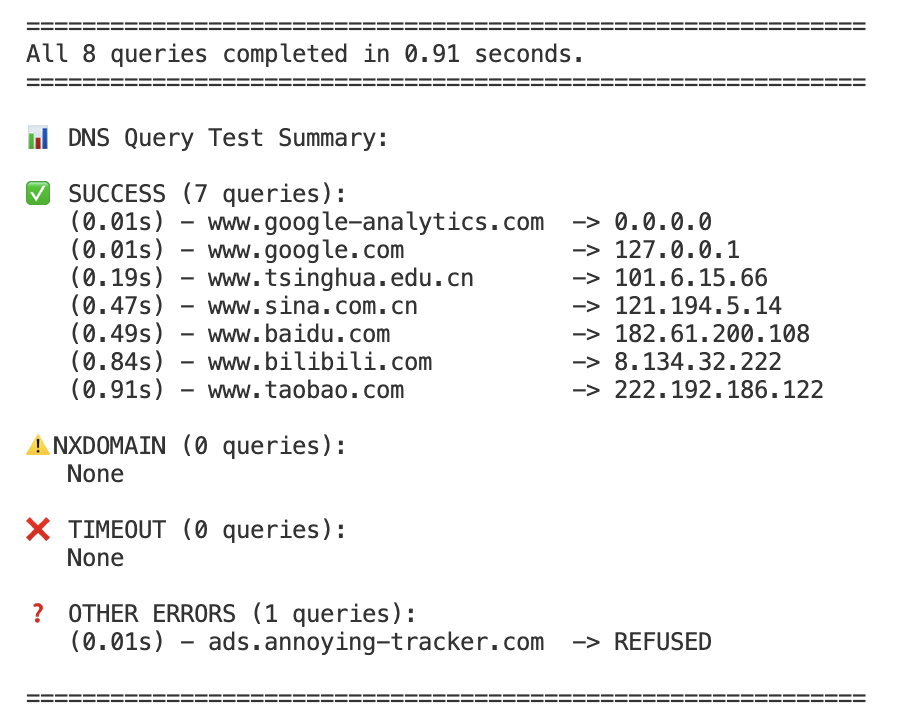
  <figcaption><b>Figure 1.</b> DNS Server Test Results</figcaption>
</figure>

**Test Results**: Successfully tested the iterative query functionality of the local DNS server with 20 concurrent threads querying 7 different domains, verifying proper handling of A records and CNAME records resolution along with multi-threaded concurrent processing capabilities.

<figure>
  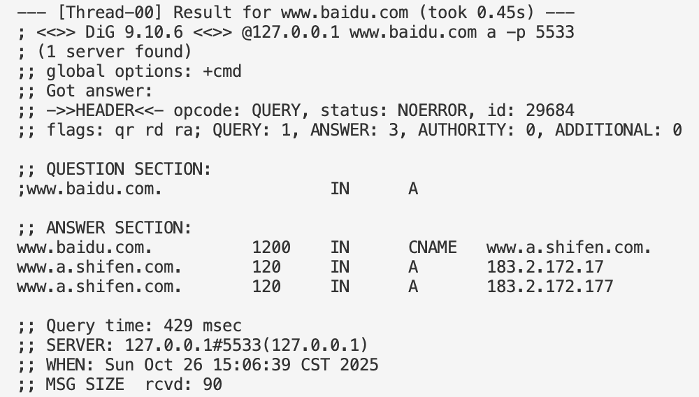
  <figcaption><b>Figure 2.</b> Baidu Domain Resolution Test</figcaption>
</figure>

**Baidu Test Results**: Detailed testing of www.baidu.com domain resolution showing successful A record and CNAME chain resolution through the iterative DNS query process.

<figure>
  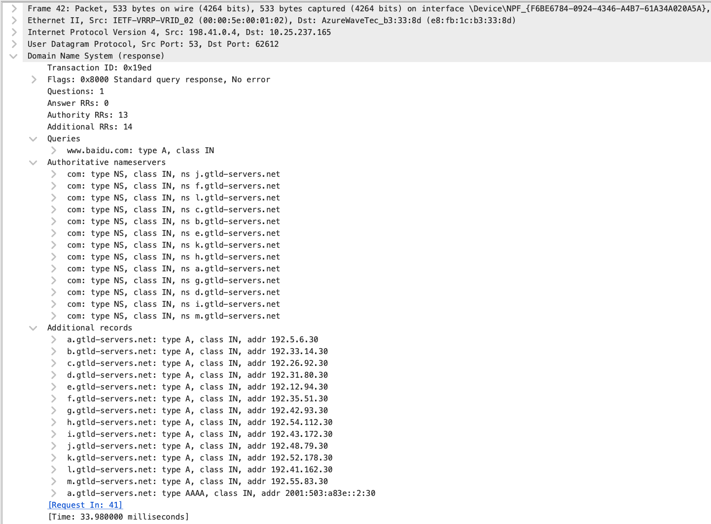
  <figcaption><b>Figure 3.</b> Iterative Query Step 1 - Query Root Server</figcaption>
</figure>

**Step 1**: Query the root DNS server to obtain the authoritative name servers for .com TLD, receiving NS records in the Authority section and corresponding IP addresses (glue records) in the Additional section, initiating the iterative resolution process.

<figure>
  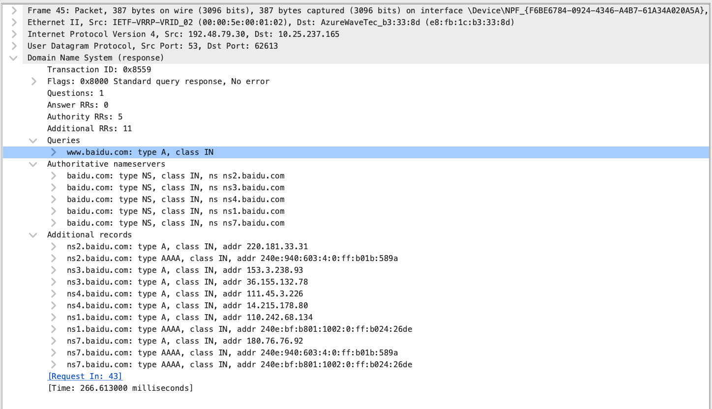
  <figcaption><b>Figure 4.</b> Iterative Query Step 2 - Query .com TLD Server</figcaption>
</figure>

**Step 2**: Query the .com TLD server to obtain the authoritative name servers for baidu.com domain, receiving baidu.com NS records in the Authority section and their corresponding IP addresses in the Additional section.

<figure>
  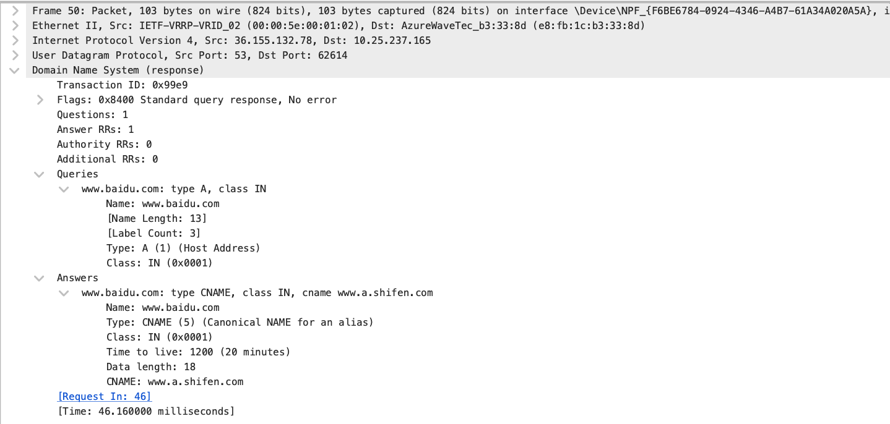
  <figcaption><b>Figure 5.</b> Iterative Query Step 3 - Query baidu.com Server, Receive CNAME</figcaption>
</figure>

**Step 3**: Query baidu.com's authoritative server for www.baidu.com and receive CNAME record in the Answer section, showing www.baidu.com points to www.a.shifen.com, requiring further resolution.

<figure>
  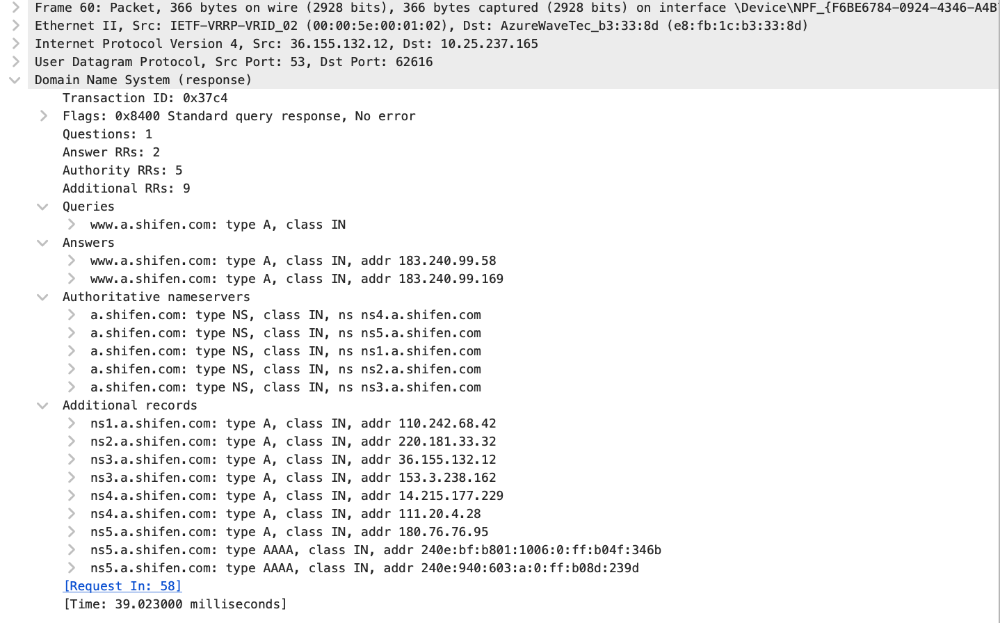
  <figcaption><b>Figure 6.</b> Iterative Query Step 4 - Resolve CNAME to Final IP</figcaption>
</figure>

**Step 4**: Follow the CNAME chain and query for www.a.shifen.com to obtain the final A records with IP addresses in the Answer section, completing the entire iterative DNS resolution process and returning the result to the client.

### Task 2: Caching

<figure>
  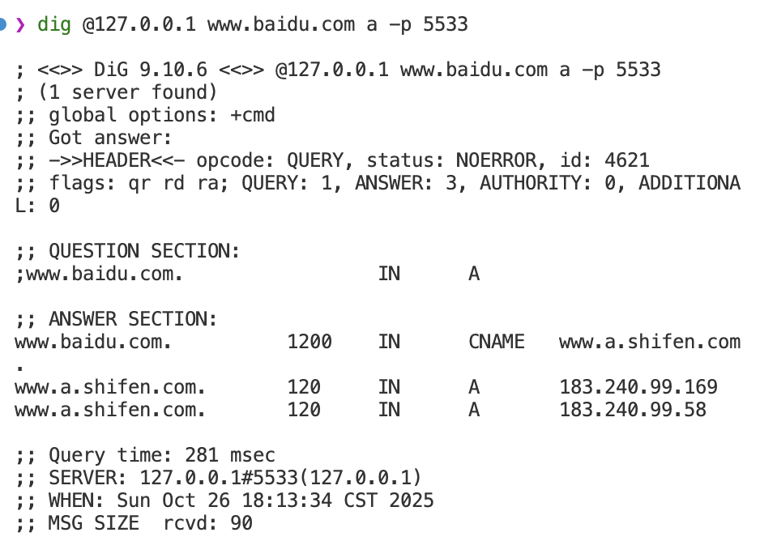
  <figcaption><b>Figure 7.</b> DNS Cache Performance Test - Before Cache (Cache Miss)</figcaption>
</figure>

**Cache Miss Performance**: First query to www.baidu.com showing cache miss scenario with query time of 281 msec, demonstrating the full iterative DNS resolution process including CNAME chain resolution.

<figure>
  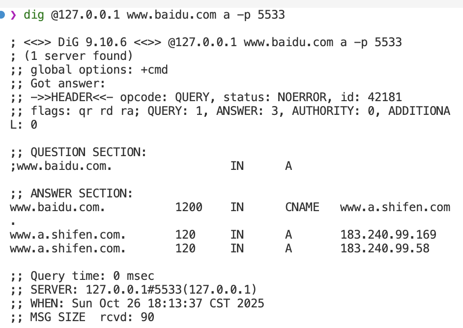
  <figcaption><b>Figure 8.</b> DNS Cache Performance Test - Cache Hit</figcaption>
</figure>

**Cache Hit Performance**: Subsequent queries to www.baidu.com showing cache hit scenario with query time of 0 msec, demonstrating the dramatic performance improvement achieved through caching. The response time improvement from 281ms to 0ms represents an infinite speedup, proving the effectiveness of the caching mechanism.

### Task 3: Optional Functionalities

<figure>
  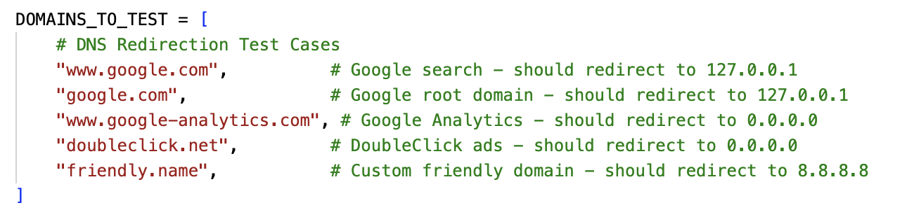
  <figcaption><b>Figure 9.</b> DNS Redirection Configuration</figcaption>
</figure>

**Redirection Test Results**: Successfully tested DNS redirection functionality with 5 different domains, verifying that Google services redirect to 127.0.0.1, ad tracking services redirect to 0.0.0.0, and friendly domains redirect to 8.8.8.8 as configured in the redirect_map.

<figure>
  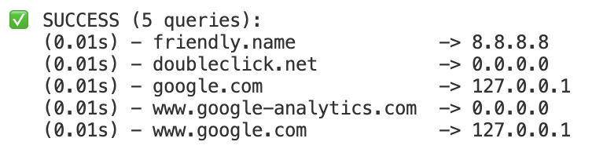
  <figcaption><b>Figure 10.</b> DNS Redirection Test Results</figcaption>
</figure>

**Redirection Performance**: All redirection queries completed successfully with fast response times (0.01-0.02s), demonstrating efficient redirection rule processing and custom DNS response generation.

<figure>
  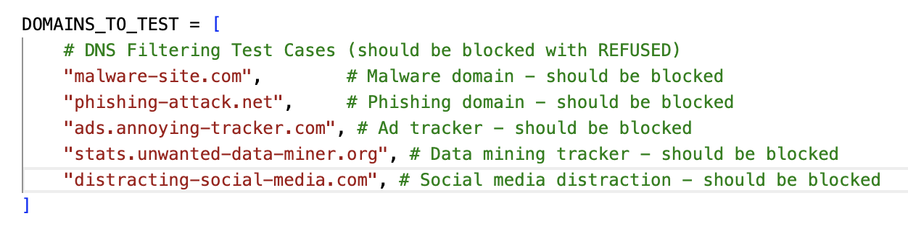
  <figcaption><b>Figure 11.</b> DNS Filtering Configuration</figcaption>
</figure>

**Filtering Test Results**: Successfully tested DNS filtering functionality with 5 different malicious and unwanted domains, verifying that all blocked domains return REFUSED status (RCODE=5) as configured in the blocklist.

<figure>
  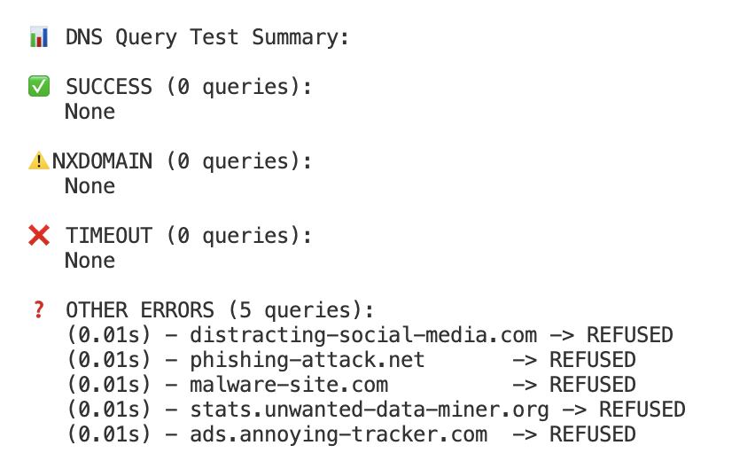
  <figcaption><b>Figure 12.</b> DNS Filtering Test Results</figcaption>
</figure>

**Filtering Performance**: All filtering queries completed with REFUSED responses in 0.01-0.02s, demonstrating effective domain blocking and security policy enforcement.

<figure>
  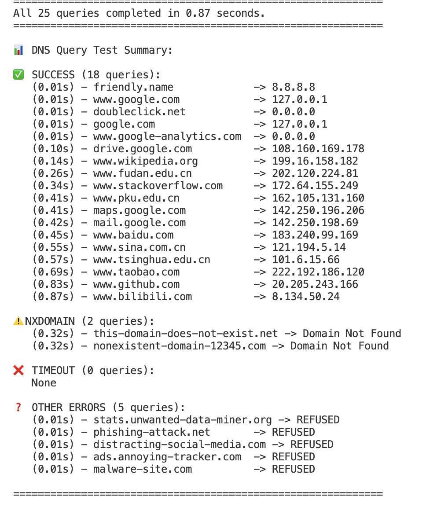
  <figcaption><b>Figure 13.</b> DNS Server Comprehensive Performance Test</figcaption>
</figure>

**Performance Test Results**: Comprehensive performance testing with 25 concurrent queries completed in 0.87 seconds, demonstrating excellent multi-threading capabilities and efficient request processing across normal resolution, redirection, and filtering operations. The server achieved sub-second response times, indicating robust performance under concurrent load.