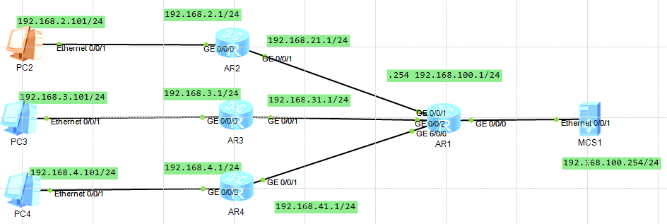
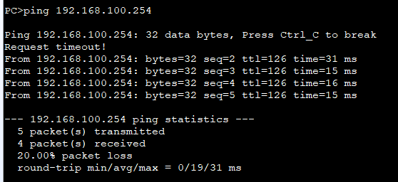
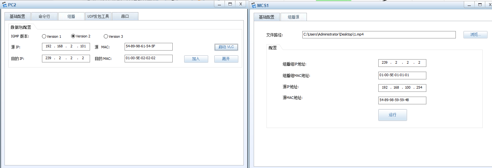
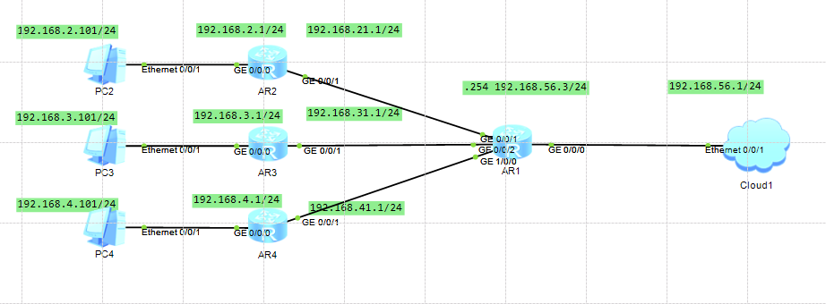
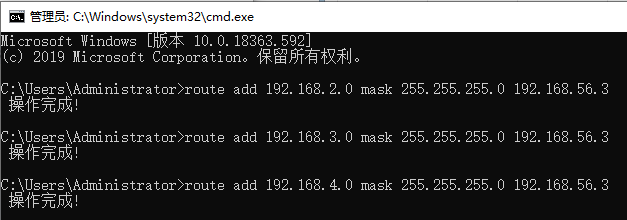
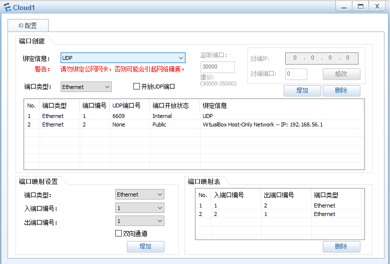

# Lab10

## Practice 10.1



AR1的配置：

```bash
<Huawei> system-view
[Huawei] sysname AR1

# 1. 全局开启组播路由
[AR1] multicast routing-enable

# 2. 配置连接 MCS1 的接口 (注意是新网段 100.1)
[AR1] interface GigabitEthernet 0/0/0
[AR1-GigabitEthernet0/0/0] ip address 192.168.100.1 24
[AR1-GigabitEthernet0/0/0] pim dm
[AR1-GigabitEthernet0/0/0] quit

# 3. 配置连接 AR2 的接口
[AR1] interface GigabitEthernet 0/0/1
[AR1-GigabitEthernet0/0/1] ip address 192.168.21.2 24
[AR1-GigabitEthernet0/0/1] pim dm
[AR1-GigabitEthernet0/0/1] quit

# 4. 配置连接 AR3 的接口
[AR1] interface GigabitEthernet 0/0/2
[AR1-GigabitEthernet0/0/2] ip address 192.168.31.2 24
[AR1-GigabitEthernet0/0/2] pim dm
[AR1-GigabitEthernet0/0/2] quit

# 5. 配置连接 AR4 的接口 (假设是扩展口 1/0/0)
[AR1] interface GigabitEthernet 1/0/0
[AR1-GigabitEthernet1/0/0] ip address 192.168.41.2 24
[AR1-GigabitEthernet1/0/0] pim dm
[AR1-GigabitEthernet1/0/0] quit

# 6. 配置 OSPF (宣告所有网段，包括新的 100.0)
[AR1] ospf 1 router-id 1.1.1.1
[AR1-ospf-1] area 0
[AR1-ospf-1-area-0.0.0.0] network 192.168.100.0 0.0.0.255
[AR1-ospf-1-area-0.0.0.0] network 192.168.21.0 0.0.0.255
[AR1-ospf-1-area-0.0.0.0] network 192.168.31.0 0.0.0.255
[AR1-ospf-1-area-0.0.0.0] network 192.168.41.0 0.0.0.255
[AR1-ospf-1-area-0.0.0.0] return
```

AR2的配置：

```bash
<Huawei> system-view
[Huawei] sysname AR2

# 1. 全局开启组播路由
[AR2] multicast routing-enable

# 2. 配置上行接口 (连接 AR1) -> 只开 PIM
[AR2] interface GigabitEthernet 0/0/1
[AR2-GigabitEthernet0/0/1] ip address 192.168.21.1 24
[AR2-GigabitEthernet0/0/1] pim dm
[AR2-GigabitEthernet0/0/1] quit

# 3. 配置下行接口 (连接 PC2) -> PIM + IGMP
[AR2] interface GigabitEthernet 0/0/0
[AR2-GigabitEthernet0/0/0] ip address 192.168.2.1 24
[AR2-GigabitEthernet0/0/0] pim dm
[AR2-GigabitEthernet0/0/0] igmp enable
[AR2-GigabitEthernet0/0/0] quit

# 4. 配置 OSPF
[AR2] ospf 1 router-id 2.2.2.2
[AR2-ospf-1] area 0
[AR2-ospf-1-area-0.0.0.0] network 192.168.2.0 0.0.0.255
[AR2-ospf-1-area-0.0.0.0] network 192.168.21.0 0.0.0.255
[AR2-ospf-1-area-0.0.0.0] return
```

PC2去pingMCS1：





（1）

​	MCS IPv4 Address：192.168.100.254

​	Multicast IPv4 Address：239.2.2.2

​	Multicast MAC Address：01-00-5E-02-02-02

（2）

| **Multicast group** | **R1 incoming interface** | **R1 outgoing interface**     | **R2 incoming interface** | **R2 outgoing interface** | **R3 incoming interface** | **R3 outgoing interface** | **R4 incoming interface** | **R4 outgoing interface** | **PC4 receive multicast pkt (Y/N)** |
| ------------------- | ------------------------- | ----------------------------- | ------------------------- | ------------------------- | ------------------------- | ------------------------- | ------------------------- | ------------------------- | ----------------------------------- |
| **PC2, PC3**        | GE0/0/0                   | **GE0/0/1, GE0/0/2**          | GE0/0/1                   | GE0/0/0                   | GE0/0/1                   | GE0/0/0                   | GE0/0/1                   | **None**                  | **N**                               |
| **PC2, PC3, PC4**   | GE0/0/0                   | **GE0/0/1, GE0/0/2, GE6/0/0** | GE0/0/1                   | GE0/0/0                   | GE0/0/1                   | GE0/0/0                   | GE0/0/1                   | **GE0/0/0**               | **Y**                               |

## Practice 10.2







（2）unicast抓包


（3）


| **Multicast group ** | **Multicast source node192.168.56.1 TX pkts** | **R1GE0 RX pkts** | **R1GE1 TX pkts(To R2)** | **R1GE2 TX pkts(To R3)** | **R1GE3 TX pkts(To R4)** | **R2GE0 TX pkts** | **R3GE0 TX pkts** | **R4GE0 TX pkts** |
| -------------------- | --------------------------------------------- | ----------------- | ------------------------ | ------------------------ | ------------------------ | ----------------- | ----------------- | ----------------- |
| **PC2, PC3**         | 4                                             | 4                 | **4**                    | **4**                    | **0**                    | 4                 | 4                 | 0                 |
| **PC2, PC3, PC4**    | 4                                             | 4                 | **4**                    | **4**                    | **4**                    | 4                 | 4                 | 4                 |

Q：Is there any ICMP reply message during the multicast test?

A：No，大多数设备默认不会对组播地址的 Ping 进行回复

Q：Compare the difference between unicast and multicast.

单播一对一，组播一对多；如果N个人需要同一份信息，单播的服务器要发N次，但组播可能只需要1次

单播client收到会回复，但是组播不会，防止太多回信导致网络堵塞
