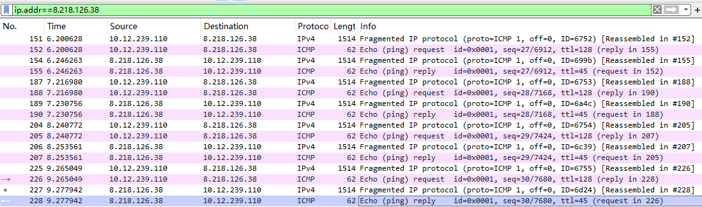
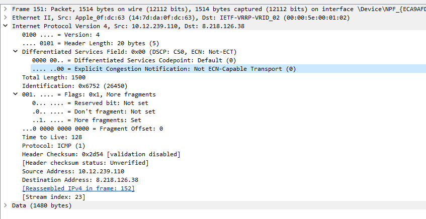
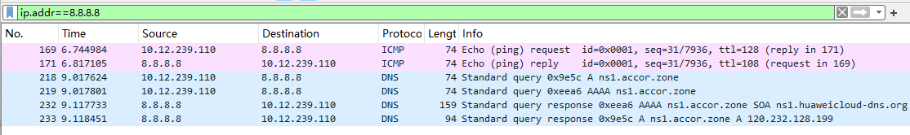
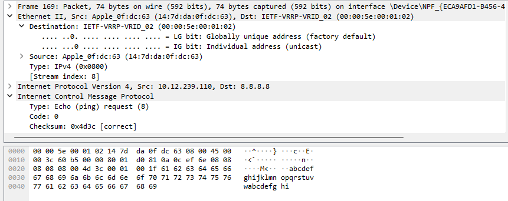
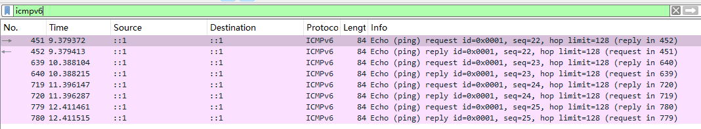
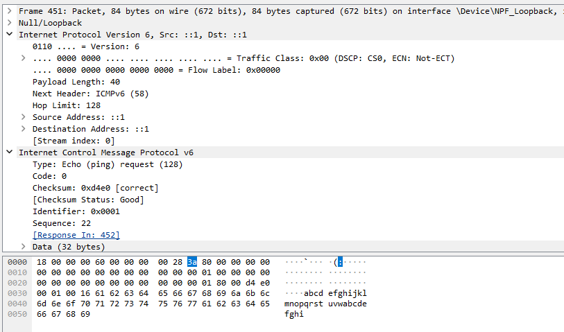

# Lab11

## Practice 11.1

命令是：ping www.example.cn -l 1500

frame151:total length=1500bytes, ip header 20bytes, data 1480bytes

frame152:total length=48bytes, ip header 20bytes, data 28bytes

ip payload 1480+28=1508, ICMP header 8bytes,

therefore ICMP data 1508-8=1500bytes

## Practice 11.2

(1)

|                                              | **ICMPv4**                                         | **ICMPv6**                                             |
| -------------------------------------------- | -------------------------------------------------- | ------------------------------------------------------ |
| **Protocol Number**                          | **1**                                              | **58**                                                 |
| **Position in IP packet**                    | **Data field of IPv4 Header** (IP 头部之后)        | **Data field of IPv6 Header** (Next Header 指向的位置) |
| **The value of ‘type’ field in ICMP header** | **8**                                              | **128**                                                |
| **The calculation method of checksum**       | **16-bit one's complement sum**                    | **16-bit one's complement sum**                        |
| **The calculation range of checksum**        | **ICMP Header + ICMP Data**                        | **IPv6 Pseudo-Header + ICMPv6 Header + ICMPv6 Data**   |
| **Function**                                 | **Network diagnostics / Reachability test (Ping)** | **Network diagnostics / Reachability test (Ping)**     |

(2)

ICMPv4:

前14bytes是Ethernet header，ip header是接下来的20bytes， ICMP header从 08 00开始

sum=0x0800+0x0000(checksum假设为0，不加进去)+0x0001+...+0x6869=0xb2c3

checksum=~(0xb2c3)=0x4d3c

ICMPv6:

pseudo-header: source address ::1, destination address ::1, upper-layer packet length 40, next header 58(ICMPv6)

pseudo-header sum=0x0001+0x0001+0x0028+0x003a=0x0064

ICMPv6 Message: 从80 00开始，checksum设为0

sum= 0x8000+0x0000+...+0x6162+0x6364

total sum= sum+pseudo-header sum=0x2b1f

checksum=~(0x2b1f)=0xd4e0

