# Lab12

## Practice 12.1

（1）

拓扑结构：

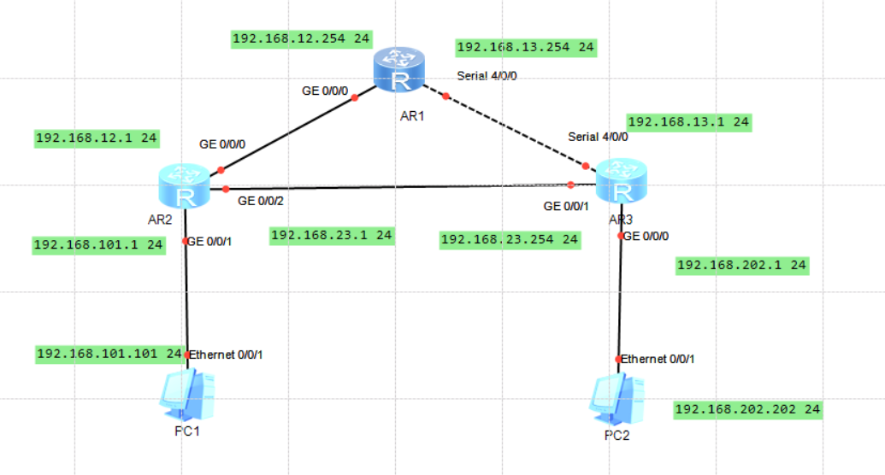

AR1配置：

```
<Huawei> system-view
[Huawei] sysname AR1

# 配置左边连接 AR2 的接口
[AR1] interface GigabitEthernet 0/0/0
[AR1-GigabitEthernet0/0/0] ip address 192.168.12.254 24
[AR1-GigabitEthernet0/0/0] quit

# 配置右边连接 AR3 的串口
[AR1] interface Serial 4/0/0
[AR1-Serial4/0/0] ip address 192.168.13.254 24
[AR1-Serial4/0/0] quit

# 配置 RIPv2 协议
[AR1] rip 1
[AR1-rip-1] version 2
[AR1-rip-1] undo summary
[AR1-rip-1] network 192.168.12.0
[AR1-rip-1] network 192.168.13.0
[AR1-rip-1] quit
```

AR2配置：

```
<Huawei> system-view
[Huawei] sysname AR2

# 配置上方连接 AR1 的接口
[AR2] interface GigabitEthernet 0/0/0
[AR2-GigabitEthernet0/0/0] ip address 192.168.12.1 24
[AR2-GigabitEthernet0/0/0] quit

# 配置右侧连接 AR3 的接口
[AR2] interface GigabitEthernet 0/0/2
[AR2-GigabitEthernet0/0/2] ip address 192.168.23.1 24
[AR2-GigabitEthernet0/0/2] quit

# 配置下方连接 PC1 的网关接口
[AR2] interface GigabitEthernet 0/0/1
[AR2-GigabitEthernet0/0/1] ip address 192.168.101.1 24
[AR2-GigabitEthernet0/0/1] quit

# 配置 RIPv2 协议
[AR2] rip 1
[AR2-rip-1] version 2
[AR2-rip-1] undo summary
[AR2-rip-1] network 192.168.12.0
[AR2-rip-1] network 192.168.23.0
[AR2-rip-1] network 192.168.101.0
[AR2-rip-1] quit
```

AR3配置：

```
<Huawei> system-view
[Huawei] sysname AR3

# 配置左上方连接 AR1 的串口 
[AR3] interface Serial 4/0/0
[AR3-Serial4/0/0] ip address 192.168.13.1 24
[AR3-Serial4/0/0] quit

# 配置左侧连接 AR2 的接口
[AR3] interface GigabitEthernet 0/0/1
[AR3-GigabitEthernet0/0/1] ip address 192.168.23.254 24
[AR3-GigabitEthernet0/0/1] quit

# 配置下方连接 PC2 的网关接口
[AR3] interface GigabitEthernet 0/0/0
[AR3-GigabitEthernet0/0/0] ip address 192.168.202.1 24
[AR3-GigabitEthernet0/0/0] quit

# 配置 RIPv2 协议
[AR3] rip 1
[AR3-rip-1] version 2
[AR3-rip-1] undo summary
[AR3-rip-1] network 192.168.13.0
[AR3-rip-1] network 192.168.23.0
[AR3-rip-1] network 192.168.202.0
[AR3-rip-1] quit
```

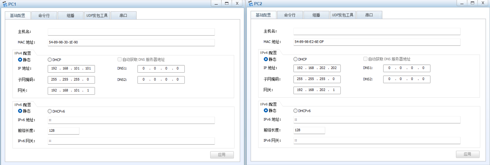

PC1连通性测试：

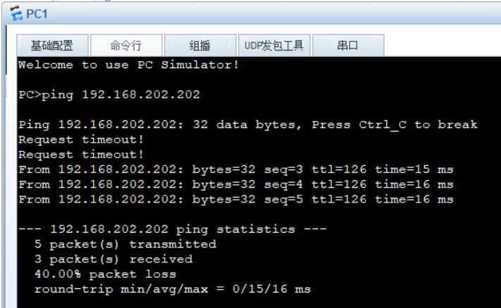

AR1路由表检查,通过RIP学习的路由：

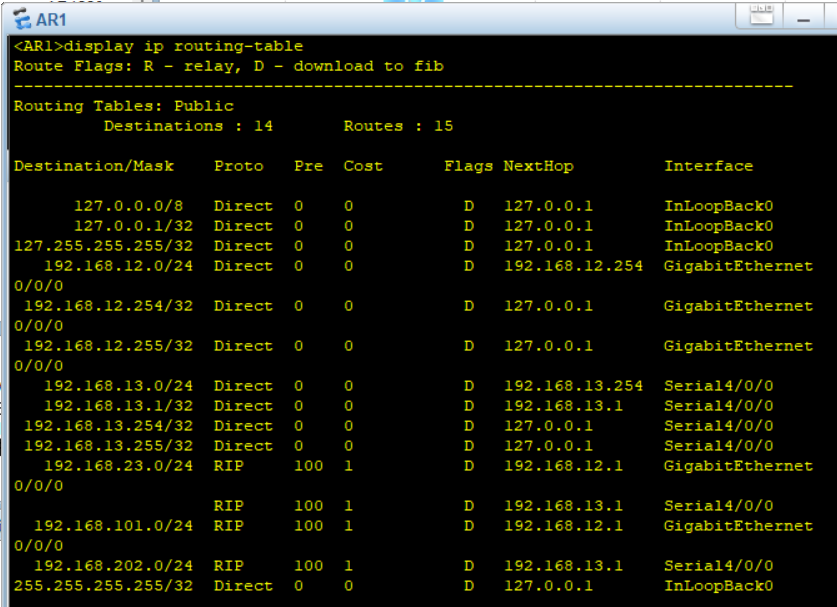

（2）

| **R1**    | **destination/Mask** | **proto** | **pre** | **cost** | **nexthop**  | **interface** |
| --------- | -------------------- | --------- | ------- | -------- | ------------ | ------------- |
| **OSPF**  | **192.168.23.0/24**  | OSPF      | 10      | 2        | 192.168.12.1 | GE0/0/0       |
| **RIPv2** | **192.168.23.0/24**  | RIP       | 100     | 1        | 192.168.12.1 | GE0/0/0       |
| **OSPF**  | **192.168.101.0/24** | OSPF      | 10      | 2        | 192.168.12.1 | GE0/0/0       |
| **RIPv2** | **192.168.101.0/24** | RIP       | 100     | 1        | 192.168.12.1 | GE0/0/0       |
| **OSPF**  | **192.168.202.0/24** | OSPF      | 10      | 3        | 192.168.12.1 | GE0/0/0       |
| **RIPv2** | **192.168.202.0/24** | RIP       | 100     | 1        | 192.168.13.1 | Serial 4/0/0  |

OSPF基于带宽计算，RIP基于跳数计算

OSPF全走了高速的GE接口，RIP去往PC2时走了低速的Serial接口

## Practice 12.2

（1）

拓扑结构：

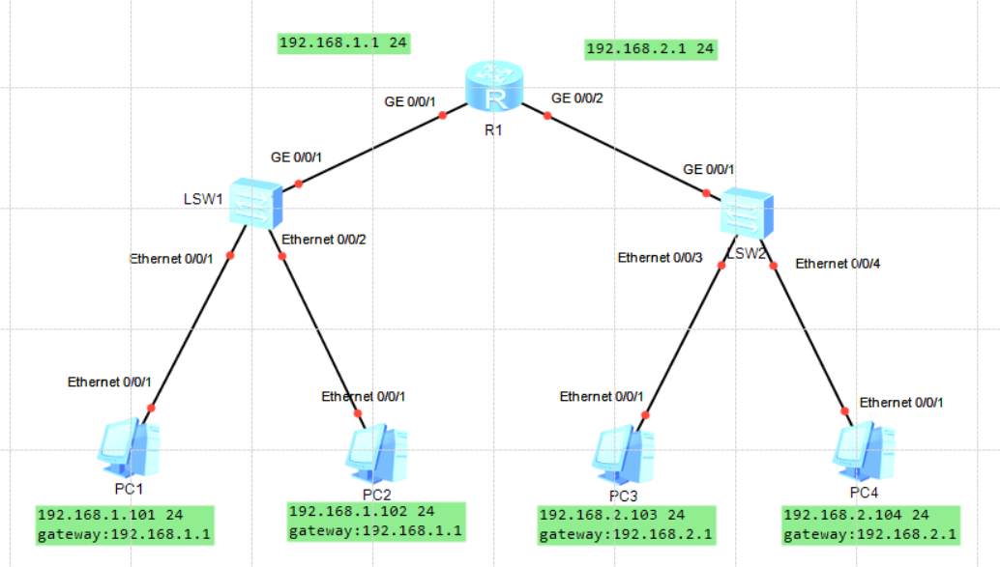

PC配置：

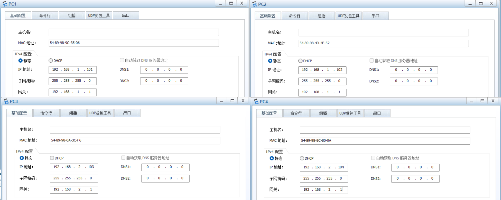

R1配置：

```
<Huawei> system-view                         
[Huawei] sysname R1                        

// 配置左侧接口 (连接 LSW1)
[R1] interface GigabitEthernet 0/0/1
[R1-GigabitEthernet0/0/1] ip address 192.168.1.1 24
[R1-GigabitEthernet0/0/1] quit

// 配置右侧接口 (连接 LSW2)
[R1] interface GigabitEthernet 0/0/2
[R1-GigabitEthernet0/0/2] ip address 192.168.2.1 24
[R1-GigabitEthernet0/0/2] return

<R1> save                                  
```

清空arp和mac表

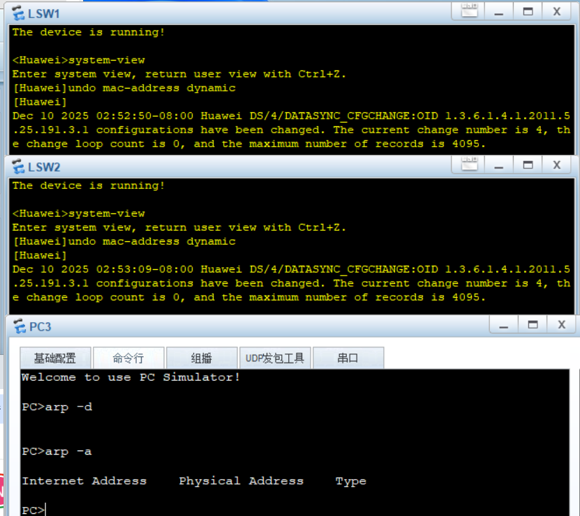

ping测试，PC3 ping PC4：

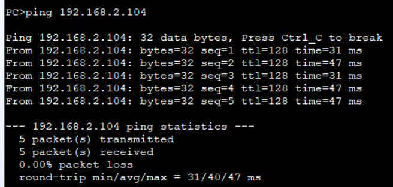

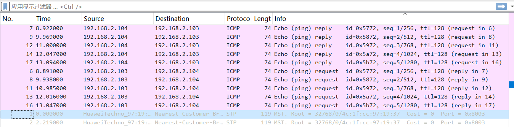

ping测试，PC3 ping PC1：

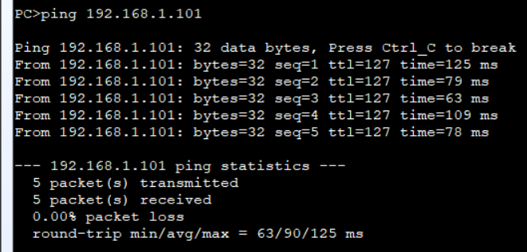

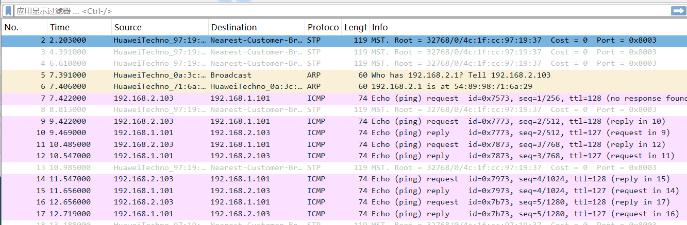

|                                                              | **invoke “ping” on PC3 to reach PC4** | **invoke “ping” on PC3 to reach PC1** |
| ------------------------------------------------------------ | ------------------------------------- | ------------------------------------- |
| **sender IP in the ARP request**                             | **192.168.2.103**  (PC3 )             | **192.168.2.103**  (PC3)              |
| **target IP in the ARP request**                             | **192.168.2.104**  (PC4)              | **192.168.2.1**  (**网关**)           |
| **While the ARP request reach to LSW2, list interfaces on LSW2 on which the ARP request was forwarded from.** | **Eth0/0/4, GE0/0/1**                 | **Eth0/0/4, GE0/0/1**                 |
| **Does the ARP request reach to the router?(Y/N)**           | **Y**                                 | **Y**                                 |
| **If the ARP request reach to the router, what does the router do after receiving the ARP request?** | **drop**  (因为目标IP不是自己)        | **reply**  (因为目标IP正是网关自己)   |
| **Which network nodes' MAC addresses would been learnt by LSW2 in this testing?** | **PC3, PC4**                          | **PC3, R1 (GE0/0/2)**                 |