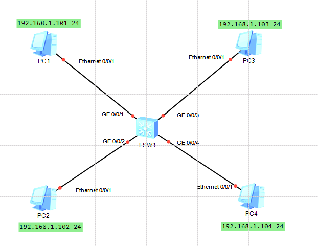
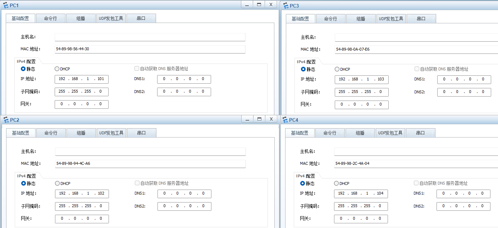
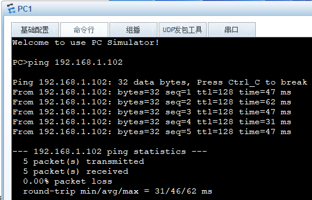
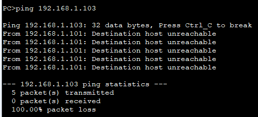
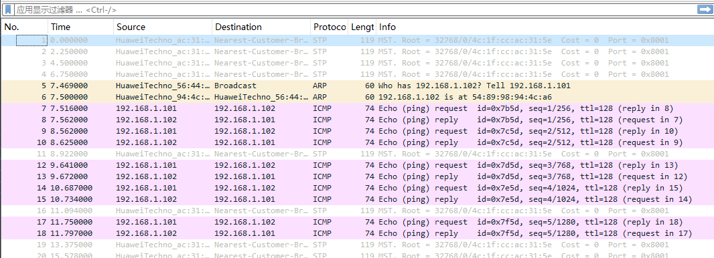
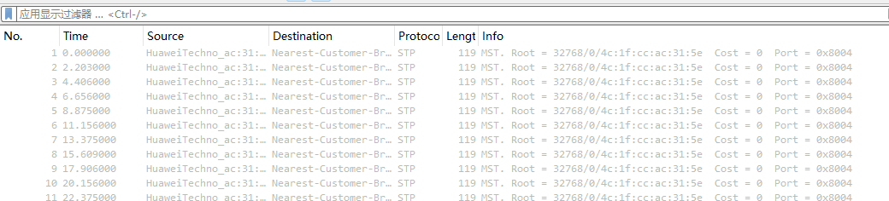
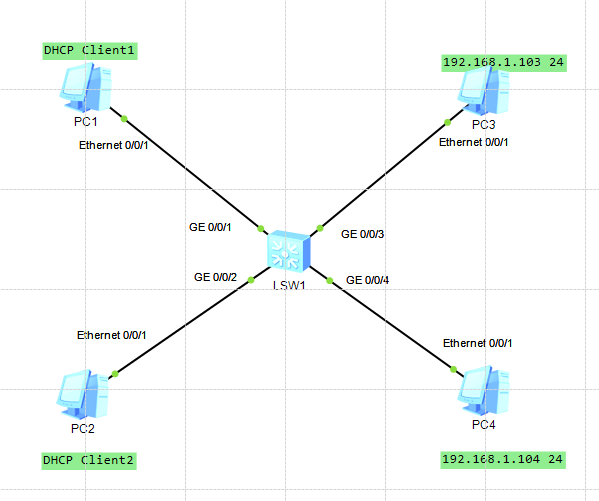
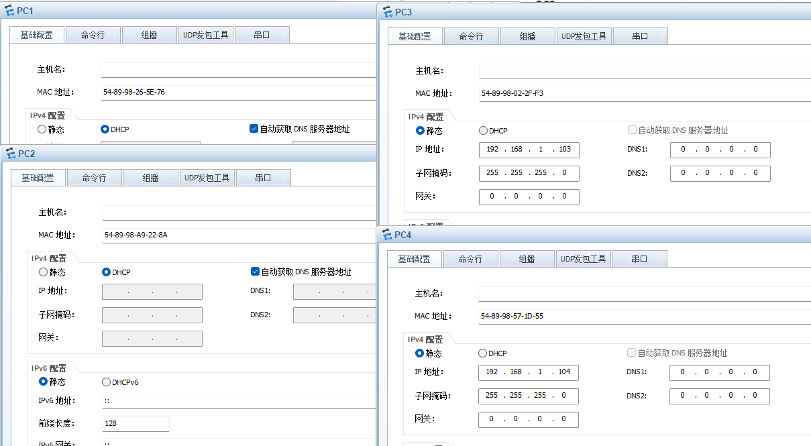
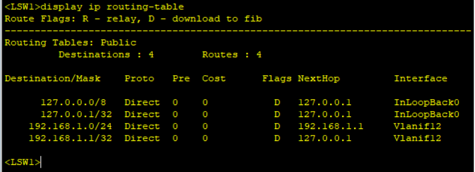
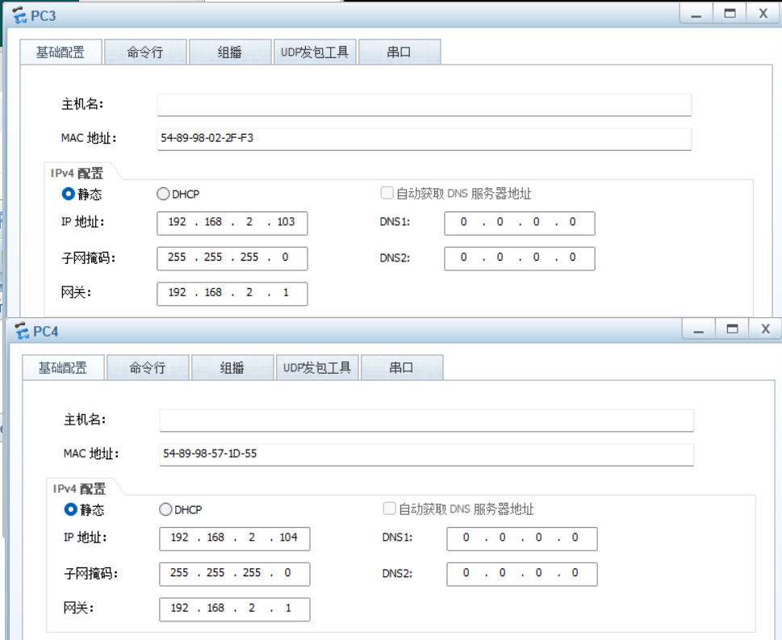

# Practice 13

## Practice 13.1

（1）

拓扑结构：



主机配置：



交换机配置：

```bash
<Huawei> system-view           
[Huawei] sysname LSW1            
[LSW1] vlan batch 12 34           // 创建 vlan 12 和 vlan 34
```

配置接口 GE 0/0/1与GE 0/0/2：

```bash
[LSW1] interface GigabitEthernet 0/0/1 
[LSW1-GigabitEthernet0/0/1] port link-type access  // 设置端口模式为 access
[LSW1-GigabitEthernet0/0/1] port default vlan 12   
[LSW1-GigabitEthernet0/0/1] quit        
[LSW1] interface GigabitEthernet 0/0/2
[LSW1-GigabitEthernet0/0/2] port link-type access
[LSW1-GigabitEthernet0/0/2] port default vlan 12
[LSW1-GigabitEthernet0/0/2] quit
```

配置接口 GE 0/0/3与GE 0/0/4：

```bash
[LSW1] interface GigabitEthernet 0/0/3
[LSW1-GigabitEthernet0/0/3] port link-type access
[LSW1-GigabitEthernet0/0/3] port default vlan 34   
[LSW1-GigabitEthernet0/0/3] quit
[LSW1] interface GigabitEthernet 0/0/4
[LSW1-GigabitEthernet0/0/4] port link-type access
[LSW1-GigabitEthernet0/0/4] port default vlan 34
[LSW1-GigabitEthernet0/0/4] return       
```

连通性测试：相同VLAN，PC1 ping PC2



连通性测试：不同VLAN，PC1 ping PC3

不通，因为VLAN12 和 VLAN 34 在二层网络中隔离



(2)

PC1 ping PC2 抓包(GE 0/0/1)：



PC1 ping PC4 抓包(GE 0/0/4)



| **Test Scenario** | **Packet Type**             | **Send?** | **ONLY VLAN 1(未划分VLAN)** | **ONLY VLAN 1(接收节点)** | **Configured VLAN 12/34(已划分VLAN)** | **Configured VLAN 12/34(接收节点)** |
| ----------------- | --------------------------- | --------- | --------------------------- | ------------------------- | ------------------------------------- | ----------------------------------- |
| **PC1 ping PC2**  | PC1 send **ARP Request**?   | **Yes**   | **Broadcast**               | **PC2, PC3, PC4**         | **Broadcast**                         | **PC2**                             |
|                   | PC2 send **ARP Reply**?     | **Yes**   | **Unicast**                 | **PC1**                   | **Unicast**                           | **PC1**                             |
|                   | PC1 send ICMP Echo Request? | **Yes**   | **Unicast**                 | **PC2**                   | **Unicast**                           | **PC2**                             |
|                   | PC2 send ICMP Echo Reply?   | **Yes**   | **Unicast**                 | **PC1**                   | **Unicast**                           | **PC1**                             |
| **PC1 ping PC4**  | PC1 send **ARP Request**?   | **Yes**   | **Broadcast**               | **PC2, PC3, PC4**         | **Broadcast**                         | **PC2**                             |
|                   | PC4 send **ARP Reply**?     | **No**    | **Unicast**                 | **PC1**                   | **- **                                | **-**                               |
|                   | PC1 send ICMP Echo Request? | **No**    | **Unicast**                 | **PC4 **                  | **- **                                | **-**                               |
|                   | PC4 send ICMP Echo Reply?   | **No**    | **Unicast**                 | **PC1 **                  | **- **                                | **-**                               |

---

## Practice 13.2

拓扑结构：



主机配置：



交换机配置：

前半部分和上面一样，后面要多DHCP的配置：

```bash
[LSW1] dhcp enable

// 进入 VLAN 12 的虚拟接口
[LSW1] interface vlanif 12

[LSW1-Vlanif12] ip address 192.168.1.1 255.255.255.0

[LSW1-Vlanif12] dhcp select interface

[LSW1-Vlanif12] return
<LSW1> save
```

路由表：



(1) What are the changes in the MAC address table and Routing  table of the switch before and after configuring the IP address of  the vlan interface?

增加了一条新的路由条目，目标网段是 `192.168.1.0/24`，出接口是 `Vlanif12`

(2) Is there any new routing-entry...? is it static, direct or generated by Routing protocol?

是的，direct

(3)  What’s the IP address, subnet mask and gateway on PC1 and PC2 ?

PC1: ip address:192.168.1.254, subnet mask: 255.255.255.0, gateway: 192.168.1.1

PC2: ip address:192.168.1.253, subnet mask: 255.255.255.0, gateway: 192.168.1.1

(4) Would the ARP request reach PC1?（PC3 ping PC1）

不能，广播包无法跨越 VLAN

(5) Would ICMP request reach PC1?

不能，PC3无法获取PC1MAC地址，不能发送ICMP包

(6) Would ICMP reply reach PC3?

不能

---

修改交换机配置和PC配置：

```
<LSW1> system-view
[LSW1] interface vlanif 34                 
[LSW1-Vlanif34] ip address 192.168.2.1 24   
[LSW1-Vlanif34] quit
```



(1)  What are the changes in the Routing table of the  switch before and after new configurations on the page?

新增了一条目标网段为 `192.168.2.0/24` 的直连路由

(7)  Would PC3 send ARP request ?  what’s the value of  “target IP Address” filed in the ARP request?

会， 192.168.2.1

PC3 需要先把数据包发给网关，所以它请求的是网关的 MAC 地址，而不是 PC1 的

(8) Would PC1 received ARP request?  what’s the value of  “target IP Address” filed in the ARP request?

会，192.168.1.254

PC1 收到的这个 ARP 不是 PC3 发的。是交换机 (网关) 收到 PC3 的数据包后，发现要去 VLAN 12，于是交换机在 VLAN 12 发起一个新的 ARP 请求，询问 PC1 的 MAC 地址

(9) Would ICMP request reach PC1? 

会，现在有路由了

(10) Would ICMP reply reach PC3?

会，现在网络连通