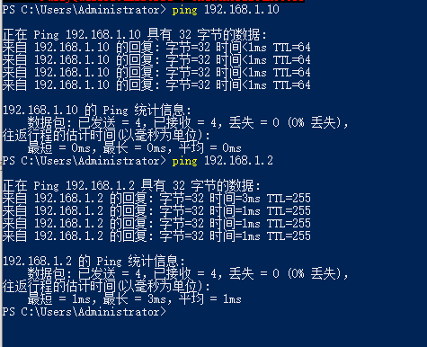
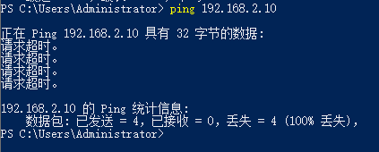
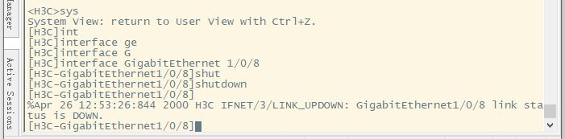
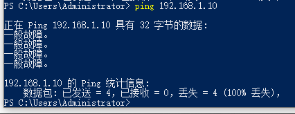
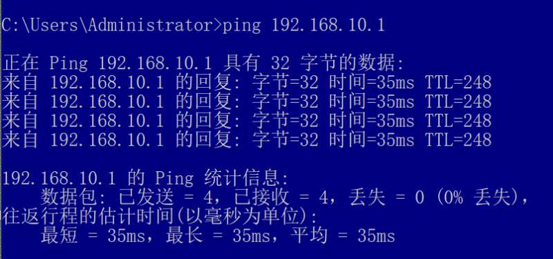

# Lab14 

## Practice 14.1

(1) Build a network: connect PCa and PCb with a Layer 3 Switch Router, set PCa  to be in the same network with PCb.

设置PCa 192.168.1.2, PCb 192.168.1.10; 子网掩码都是255.255.255.0

PCa连接到交换机的  GigabitEthernet1/0/8, PCb连接到交换机的 GigabitEthernet1/0/18

查看交换机的mac地址表：


(2) On PCa , use “ping” to test whether PCb is reachable.

PCa 去ping PCb，如图，可达：



(3) Use at least two ways to make PCa un-reachable from PCb without changing the connections on them.

方法一：修改PCb的ip地址，变成192.168.2.10（换到不同子网）


无法从PCa ping到PCb了：



方法二：关闭接口，在交换机命令行中进入PCa借口，shutdown



同样无法从PCa ping到PCb了：



(4) After finishing step1~3, using “display mac-address” to find the mac-address table of Layer 3 Switch/Router:

1) How many items are there on the switch mac-address table? Are they static or dynamic?

   交换机MAC地址表有2条记录，一个PCa的一个PCb的；是Dynamic的，是通过MAC地址学习的到的

2) For every item, does the mac-address belong to the connected PC or the connected interface of  Layer 3 Switch / Router?

   MAC 地址属于连接的 PC (PCa, PCb)，而不是交换机的接口

## Practice 14.2

(1) Use  ”display vlan brief” to find the information about VLAN and interface.

设置PCa 192.168.1.1， PCb 192.168.1.2

Interface 'a1' = GigabitEthernet 0/2， Interface 'b1' = GigabitEthernet 0/7


(2) Is there any default VLAN on Layer 3 Switch / Router? Which interfaces belong to this default 
VLAN?

是的，通常存在默认 VLAN1; 初始状态下，交换机上的所有接口默认都属于 VLAN 1

(3) Create two VLANs: VLAN ‘x’ and VLAN ‘y’  on Layer3 Switch / Router.

(4) Configure the VLANs and interfaces:

1. Giga-ethernet interface ‘a1’ accesses to VLAN ‘x’
2. Giga-ethernet interface ‘b1’ accesses to VLAN ‘y’

(5) Setup the connections:

1. Connect the Giga-ethernet interface ‘a1’ with PCa 
2. Connect the Giga-ethernet interface ‘b1’ with PCb 

```bash
<Huawei> system-view
[Huawei] sysname SwitchB

[SwitchB] vlan batch 10 20

# 配置接口 a1 (连接 PCa) 加入 VLAN 10
[SwitchB] interface GigabitEthernet 0/2
[SwitchB-GigabitEthernet0/0/1] port link-type access
[SwitchB-GigabitEthernet0/0/1] port access vlan 10
[SwitchB-GigabitEthernet0/0/1] quit

# 配置接口 b1 (连接 PCb) 加入 VLAN 20
[SwitchB] interface GigabitEthernet 0/7
[SwitchB-GigabitEthernet0/0/2] port link-type access
[SwitchB-GigabitEthernet0/0/2] port access vlan 20
[SwitchB-GigabitEthernet0/0/2] quit
```

(6) Configure PCa and PCb with static IP addresses which belong to the same network. Use “ping” on PCa to test if PCb is reachable.


不通，物理上它们连接在不同的 VLAN 中，被隔离了；PCa ping PCb时，发送ARP广播request，但是被限制在VLAN10内了，交换机不会将其转发到VLAN20

(7) Is there anyway to make the PCa reachable from PCb without changing the connection? Try 
and test.

必须用三层路由功能，在三层交换机上为每个 VLAN 配置一个逻辑接口（VLANIF 接口）作为网关；

PCa 改为 `192.168.10.2` (网关指向 192.168.10.1)，PCb 改为 `192.168.20.2` (网关指向 192.168.20.1)

```bash
#VLAN10 配置网关
[SwitchB] interface vlan 10
[SwitchB-Vlanif10] ip address 192.168.10.1 24

#VLAN20 配置网关
[SwitchB] interface vlan 20
[SwitchB-Vlanif20] ip address 192.168.20.1 24
```


