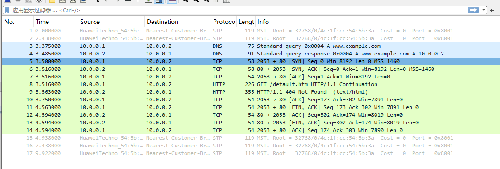

# Lab8 Practice2

1)  What’s the port number of DNS server?

   

   DNS server's port number is 53

   ---

2)  Is there any TCP session? such as TCP handshake, TCP wave farewell?

​	Yes, there is.

3.  In DNS session and HTTP session, are the ports of client same or not?

​	

​	The port numbers are different: DNS session: 49153 and 53; HTTP session: 2053 and 80.

4. While the Client and Server are in different subnet, which device need to be added to the network topology?

​	A router. Gateway needs to be set.

